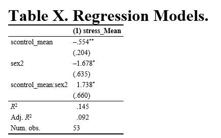

# 第八讲：如何进行基本的数据分析: 相关与回归{#lesson-8}


## 什么是相关
相关分析是一种统计技术，用于测量两个变量之间线性关系的强度和方向。它涉及计算相关系数，这是一个范围从-1到1的值，其中-1表示完全的负相关，0表示无相关，1表示完全正相关。
**Pearson(皮尔逊)相关**
Pearson相关系数是最常用的方法之一，用于衡量两个变量之间的线性相关程度，取值范围为-1到1之间，其值越接近于1或-1表示两个变量之间的线性相关程度越强，而越接近于0则表示两个变量之间线性相关程度越弱或不存在线性相关性。
**Spearman(斯皮尔曼)相关**
Spearman等级相关系数用于衡量两个变量之间的关联程度，但不要求变量呈现线性关系，而是通过对变量的等级进行比较来计算它们之间的相关性。

**Kendall(肯德尔)相关**
Kendall秩相关系数也用于衡量两个变量之间的关联程度，其计算方式与Spearman等级相关系数类似，但它是基于每个变量的秩的比较来计算它们之间的相关性。

**假想问题**
在penguin数据中，参与者压力和自律水平的相关水平？

## 相关-代码实现


```r
# 检查是否已安装 pacman
if (!requireNamespace("pacman", quietly = TRUE)) {
  install.packages("pacman") }   # 如果未安装，则安装包

# 使用p_load来载入需要的包
pacman::p_load("tidyverse", "bruceR", "performance")

# 或者直接使用 easystats这个系列

pacman::p_load("tidyverse", "bruceR", "easystats")
```

检查工作路径 - 导入原始数据

```r
# 检查工作路径
getwd()
```

```
## [1] "C:/GitHub/R4PsyBook/bookdown_files/Books/Book"
```

```r
#读取数据
df.pg.raw <- read.csv('./data/penguin/penguin_rawdata.csv',
                      header = T, 
                      sep=",", 
                      stringsAsFactors = FALSE)
```


我们需要将数据导入R中，并进行数据清洗和转换。然后，我们可以使用Tidyverse包中的函数来选择和转换数据。在进行反向计分后，我们可以使用mutate函数来计算每个问卷的得分。
接下来，我们选择性别、压力和自我控制这三个变量，并使用Bruce R中的相关分析方法来计算它们之间的相关性。需要注意的是，当我们有多个变量需要进行两两相关性分析时，需要进行P值的多重性校正。我们最后得到的是一个宽数据，我们可以在此基础上进行进一步的分析。


```r
df.pg.corr <- df.pg.raw %>%
  dplyr::filter(sex > 0 & sex < 3) %>% # 筛选出男性和女性的数据
  dplyr::select(sex, 
                starts_with("scontrol"), 
                starts_with("stress")) %>% # 筛选出需要的变量
  dplyr::mutate(across(c(scontrol2, scontrol3,scontrol4, 
                         scontrol5,scontrol7, scontrol9,
                         scontrol10,scontrol12,scontrol13,
                         stress4, stress5, stress6,stress7, 
                         stress9, stress10,stress13), 
                     ~ case_when(. == '1' ~ '5',
                                 . == '2' ~ '4',
                                 . == '3' ~ '3',
                                 . == '4' ~ '2',
                                 . == '5' ~ '1',
                                 TRUE ~ as.character(.)))
                ) %>% # 反向计分修正
  dplyr::mutate(across(starts_with("scontrol") 
                       | starts_with("stress"), 
                       ~ as.numeric(.))
                ) %>% # 将数据类型转化为numeric
  dplyr::mutate(stress_mean = 
                  rowMeans(select(.,starts_with("stress")),
                           na.rm = T),
                scontrol_mean = 
                  rowMeans(select(., starts_with("scontrol")), 
                           na.rm = T)
                ) %>% # 根据子项目求综合平均
  dplyr::select(sex, stress_mean, scontrol_mean)
```

查看一下前五行

```{=html}
<div id="htmlwidget-0eb34935aa8d491c666b" style="width:100%;height:auto;" class="datatables html-widget"></div>
<script type="application/json" data-for="htmlwidget-0eb34935aa8d491c666b">{"x":{"filter":"none","vertical":false,"fillContainer":true,"data":[["1","2","3","4","5"],[1,1,1,2,1],[2.93846153846154,2.96410256410256,3.42564102564103,3.12307692307692,3.5025641025641],[3,2.38461538461538,2.38461538461538,3.46153846153846,2.46153846153846]],"container":"<table class=\"display fill-container\">\n  <thead>\n    <tr>\n      <th> <\/th>\n      <th>sex<\/th>\n      <th>stress_mean<\/th>\n      <th>scontrol_mean<\/th>\n    <\/tr>\n  <\/thead>\n<\/table>","options":{"pageLength":5,"columnDefs":[{"className":"dt-right","targets":[1,2,3]},{"orderable":false,"targets":0}],"order":[],"autoWidth":false,"orderClasses":false,"lengthMenu":[5,10,25,50,100]}},"evals":[],"jsHooks":[]}</script>
```


bruceR::Corr()

```r
results.Corr <- capture.output({
  bruceR::Corr(data = df.pg.corr[,c(2,3)], 
               file = "./output/chp8/Corr.doc")
})
```


```r
writeLines(results.Corr, "./output/chp8/Corr.md") # .md最整齐
```
Bruce R默认的采用的是pearson相关，那么你也可以选择使用spearman或者kendall 然后另外如果我们有多个,比方说我们有三个变量，两两之间计算相关的话 那么我们往往是要进行这个P值的多重性的校正的，假如说我们只有两个变量的话 那肯定是不需要了 因为不存在这个多重比较较真的问题，假如说我们有三个以上变量，这个肯定是要校正的。 

在保存文件时，要注意文件名和文件类型的后缀。


我们也可以用散点图来展示变量之间的相关性。

```r
#绘制相关散点图
pairs(df.pg.corr[,c(2,3)])
```


我们RStudio有4个panel，最右下角的这个面板是用来画图的，有的时候大家可能会觉得发现画的图没有输出，可能就是这个地方 绘图的区域留的不够大，如果这个地方留的不够大的话，有可能就画不出来。 

运行完了之后它会自动的输出一个图 我们可以看到就是stress_mean和control_mean，它自动会以一个矩阵的形式来输出一个相关矩阵 
然后我们可以看到这里有一个从-1到1的一个 legend图例，颜色越浅的话表示相关越低，它应该会把显著的相关会标出来，如果没有记错的话，这个地方可以看到它这里显示的数字 就是它的相关系数0.05，这是一个相当小的一个相关系数。
我们其实也可以把它输出为一个word文档，需要注意的是我们可能需要精确的指出我们以哪些columns作为输入 假如说大家不选择的话，它会把性别和我们的别的变量也做相关,与其他的两个连续变量也会做相关。但这样的情况是不能用pearson的。
假如说们有一个变量是男性和女性，另外一个变量是连续的变量，我们不能直接用pearson做相关，我们应该用点二类相关，或者直接使用t检验。


那么在ezstates里面有一个类似的包叫做correlation，那么correlation它会有一个好处就是它会输出更多的信息，尤其当我们做探索性的分析的时候。我们前面讲探索性的分析，假如说我们对这个变量并不是特别清楚，哪些变量之间有相关，我们想去探索一下。
它就会以这样一个可说话的方式告诉我，哪两个变量之间相关变强，哪两个变量相对弱，那么我一下可能就能看出变量之间的一个模式。

## 什么是回归

回归模型是通过对观测数据进行拟合来描述变量之间的关系。回归允许我们估计因变量如何随着自变量的变化而变化。
我们说线性模型, 基本上是我们整个经典统计, 包括我们所有的T-test,LOVA,还有相关,还有我们说的回归分析，包括单变量,多变量,回归分析,它所有的都是有一个共同的技术, 我们说它叫做GLM,Generalized Linear Model, 或者更加复杂点叫做Generalized Linear Mixed Model,它本质上就是Y=A+BX。我们通常会将Y写成为预测项，有时候我们会在预测项上加上一个误差，这是可以扩展的，我们也可以假设他是一个非线性的关系，当它是线性的时候，我们实际上是在预测一个正态分布的均值，如果我们不是预测均值，我们可以通过一个转换，使用一个链接函数，转化后的参数仍然能用这种方法来组合预测，这个自变量或者因变量可以是非连续的变量。
## 回归-代码实现

$$y = \beta_0 + \beta_1 x_1 + \beta_2 x_2 + ... + \beta_p x_p + \epsilon$$

假想的问题
“在penguin数据中，我们希望找到参与者压力和自律水平关于性别的回归？”


```r
# 数据预处理
df.pg.lm <- df.pg.corr %>%
# 将sex变量转化为factor类型
  mutate(sex = as.factor(sex)) %>%
# 自变量为scontrol和sex
  group_by(scontrol_mean,sex) %>%
# 根据分组获得stress的平均值，。groups属性保留了之前的group_by
  summarise(stress_Mean = mean(stress_mean),.groups = 'keep')
```

如果我们希望找到压，自律以及性别之间的一个关系, 我们先做了correlation，然后把性别转换一下,然后再把数据进行group by, 这是我们的数据预处理的过程。
数据预处理之后的话,我们其实首先可以做一个探索分析，它们是不是有一个关系? 那么我们可以先用ggPlot画一个图，把男性和女性的数据就分别以不同的颜色画出来。 可以看到这里面我们用geom_smooth(), 当我们绘制了散点，需要继续绘制趋势线的时候,他自动使用了一个formula,y ~ x，这就表示用x来预测y。这时候的y就是strength， x就是self-control。两条线看起来是交叉的，这说明 在这个女性当中是有一个相关, 在男性当中好像没有这个相关，那么我们后面可以对它进行一个检验。 


```r
# 使用ggplot()画图
ggplot(df.pg.lm, aes(x = scontrol_mean, y = stress_Mean, color = sex)) + 
  geom_point() + 
  geom_smooth(method = "lm") + 
  scale_color_discrete(name = "Gender",
                       labels = c("Female", "Male")) +
  theme_minimal()
```

```
## `geom_smooth()` using formula = 'y ~ x'
```


那么我们直接使用lm linear model。它实际上是base里面的一个函数。这实际上是R里面写回归的一个常用的公式的写法, 就是说我们把一边选自变量,对吧,一边选因变量,然后另外一个选自备量,然后它就自动给我们输出结果。 那么在R里面的话,你必须要自己把这个公式写清楚。

我们使用主观压力stress作为一个因变量， 公式右边也就是我们的自变量，分别是sex性别和scontrol_mean，还有第三个自变量就是性别和控制的一个交互作用对吧,因为我们有两个自备量,所以两个自备量之间它可能会有交互作用。  
这种写法大家如果说你后面长期要用它,然后做线性回归,或者是基于线性回归的一些方法的话,这个可能你还是最好要了解一下。 
我们的公式会作为第一个参数被输入到函数里面。你也可以更完善的补全它的argument，它应该就是formula等于这个后面的一串。 然后后面就是data等于df什么什么,这个地方所以我们基本上都把这两个argument给省略掉了。
那然后的话我们其实你运行了这个代码之后的话,它就会把这个结果,会把这个线性回归的结果存到一个叫mod的变量里去,就在我们电脑上面了对吧,内存里面了。
那这个时候的话我们可以就是用mod_summary,然后呢来去把它把它结果提取出来。 


```r
# 建立回归模型
mod <- lm(stress_Mean ~ scontrol_mean + sex + scontrol_mean:sex, df.pg.lm)
# 使用bruceR::model_summary()输出结果
result.lm <- capture.output({
  model_summary(mod,
                std = T,
                file = "./output/chp8/Lm.doc")
  })
writeLines(result.lm, "./output/chp8/Lm.md") 
```
这是我们的显著性检验，我们可以看到selfcontrol的预测作用和sex的预测作用以及它们之间的交互作用。他们的显著性可以在这里看到，然后呢我们看这个决定系数对吧,这个整个模型的一个决定系数,解释了多少变异,然后adjusted就是调整之后的,还有number of observations 53。 

我们推荐一个很好的包：performance,这个performance是专门为了解决我们常用的这个统计里面的这个模型,包括像我们Anova T-test等模型。它会检查我们这个模型的各个方面,比如posterior predictive check，inlinearity，方差齐性，共线性等等。 还有正态性的一个检验对吧,这里面会有各种各样的一些检验,那么大家如果需要去做完这个模型之后,需要去对自己的模型是不是符合做这个模型的一个假定一个assumption。
它还可以进行模型比较,比如我们有模型1是有交互作用的,模型2是没有交互作用的。然后甚至比方说模型3和5只有性别的一个自变量作用,我们有三个模型,我们能够看到哪个模型能够更合理的解释数据的变异,可以用model comparison这个函数来对三个模型进行比较,这个在easy state里面有的。 

那么关于这部分的话,我们就是说有两个需要强调的,第一个就是说我们的公式如何写,对于第一次在R里面接触回归模型的同学来说,我们可能要注意,它是这么一个固定的套路。 
然后第二个就是我们如果说是用简单的回归的话,那基本上用LM这个就可以了,然后大家在心理统计学,一个变量和另外一个变量的预设作用或者多个变量和一个变量的预设作用LM都是可以做到的。 然后比方说甚至你这个变量类型,像我们这里放了一个二分的变量对吧,它也是可以的。
